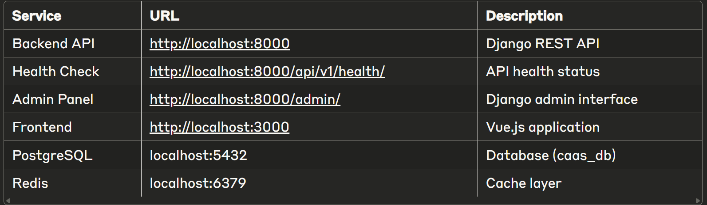
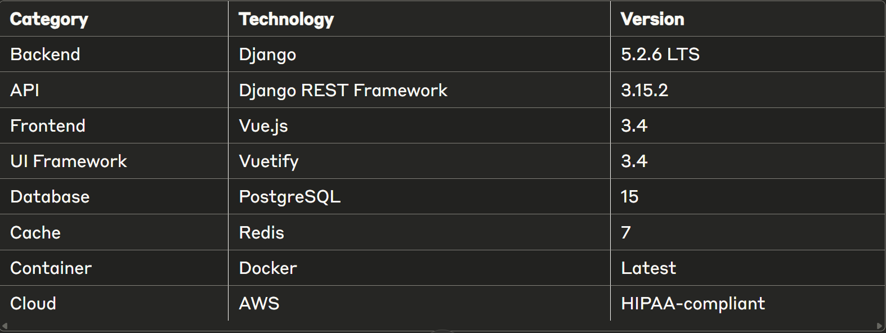

# CAAS - Compliance Automation AI Security Platform

A HIPAA-compliant vendor risk management platform that automates compliance assessments, monitors vendor risks in real-time, and leverages AI to reduce manual compliance work by 75%.

## 🏗️ Project Structure
caas/
├── backend/          # Django REST API
├── frontend/         # Vue.js SPA
├── infrastructure/   # Docker & deployment configs
├── docs/            # Documentation
├── .env             # Environment variables (create from .env.example)
├── .env.example     # Example environment configuration
└── docker-compose.yml # Container orchestration

## 🚀 Quick Start

### Prerequisites
- Docker Desktop (Windows/Mac) or Docker Engine (Linux)
- Git
- Code editor (VS Code recommended)
- PowerShell (Windows) or Terminal (Mac/Linux)

### 🐳 Docker Setup (Recommended)

1. **Clone the repository**
   git clone [your-repo-url]
   cd caas

2. **Create environment file**
   cp .env.example .env
   Edit .env with your settings

3. **Build and start all services**
   docker-compose build
   docker-compose up -d

4. **Access the application**
   docker-compose ps

5. **Run database migrations**
   docker exec caas_backend python manage.py migrate

6. **Create superuser**
   docker exec -it caas_backend python manage.py createsuperuser

### 📍 Available Services

## 🛠️ Development Workflow

### View logs
docker-compose logs -f [service_name]

**Examples:**
- Backend: `docker-compose logs -f backend`
- Frontend: `docker-compose logs -f frontend`

### Stop services
`bashdocker-compose down`

### Rebuild after dependency changes
`bashdocker-compose build --no-cache [service_name]`
`docker-compose up -d`

### Access container shell
`bashdocker exec -it caas_backend bash`
`docker exec -it caas_frontend sh`

## 💻 Local Development (Without Docker)
If you prefer to run services locally:

### Backend Setup
cd ./backend
python -m venv .venv
.venv\Scripts\activate  <!-- windows -->
#### or
source .venv/bin/activate  <!-- Mac/Linux -->

pip install -r requirements/development.txt
python manage.py migrate
python manage.py createsuperuser
python manage.py runserver

### Frontend Setup
cd frontend
npm install
npm run dev

## 🔧 Tech Stack

## 🐛 Common Issues & Solutions

### Backend won't start

* **Issue:** ModuleNotFoundError
* **Solution:** Rebuild with `docker-compose build --no-cache backend`

### Can't connect to services

* **Issue:** Connection refused
* **Solution:** Ensure Docker Desktop is running and ports aren't in use

### Database connection errors

* **Issue:** PostgreSQL not ready
* **Solution:** Wait for health checks or restart with `docker-compose restart backend`

## 📋 Development Progress

### ✅ Sprint 1: Foundation (Complete)

* Django backend initialized
* Vue.js frontend initialized
* Docker Compose setup
* Core apps created (authentication, audit, organizations)
* HIPAA-compliant settings
* API health check endpoint
* Frontend-backend connection verified
* Development environment documentation

### 🔄 Sprint 2: Core Features (In Progress)

* JWT authentication with 2FA
* User registration flow
* Vendor profiles
* Assessment builder
* Document management

### 📅 Sprint 3: AI & Production (Planned)

* AI integration
* Real-time updates
* Performance optimization
* Production deployment

## 🔐 Security Considerations

* All data encrypted at rest and in transit
* JWT tokens expire after 15 minutes (HIPAA requirement)
* Audit logging for all data access
* Environment variables for sensitive configuration
* HTTPS enforced in production

## 🤝 Contributing

* Create a feature branch: `git checkout -b feature/your-feature`
* Commit changes: `git commit -m "feat: add new feature"`
* Push to branch: `git push origin feature/your-feature`
* Submit a pull request

### Commit Message Format

* feat: New features
* fix: Bug fixes
* docs: Documentation changes
* test: Test additions/changes
* chore: Maintenance tasks

## ⚖️ License & Usage Rights

**This code is for interview evaluation purposes only.**

This project is licensed under a **Custom Interview & Evaluation License** (see [LICENSE](https://github.com/andyctaylor/Compliance-Automation-AI-Security/blob/main/LICENSE) file for full text).

**Key Points:**
- You may **view, clone, and test locally** for skill assessment
- **Commercial use, distribution, or deployment is prohibited** without written permission
- **No modifications or derivative works** allowed without explicit consent

**Need permission?** Contact: [andy@angelusct.com]

**Summary:** Think of this as a private portfolio showing—look, evaluate, but don't use or share.

## 👨‍💻 Development Team
Angelus Taylor - CEO | Full Stack Developer
